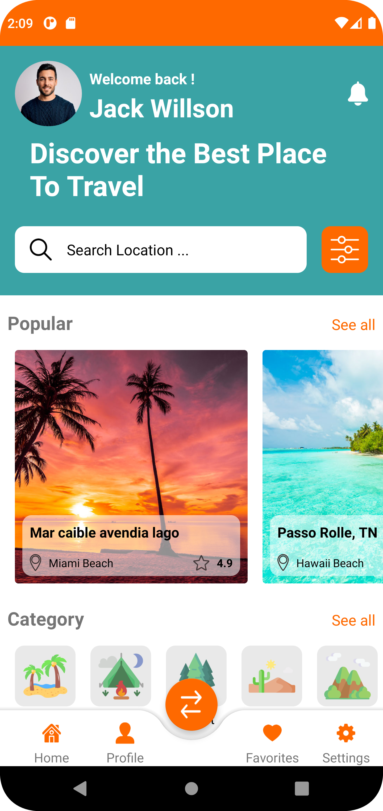
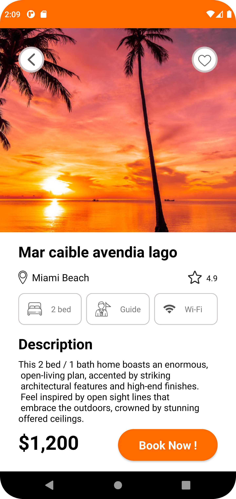

# Material_Design_No136

<p align="center">



</p>

# ✈️ TravelMate – Your Smart Travel Companion 🌍

**TravelMate** is a user-friendly Android application that helps travelers plan, organize, and enjoy their trips more efficiently. From exploring destinations to managing packing lists, TravelMate is designed to be your all-in-one travel partner.

## 📱 Features

- 🗺️ **Explore Destinations** – Discover top tourist spots and hidden gems
- 📅 **Trip Planner** – Create detailed itineraries with dates, activities, and notes
- 🧳 **Packing Checklist** – Generate and manage custom packing lists
- 🏨 **Booking Links** – Direct access to hotel and transport booking websites
- 📌 **Offline Support** – Save your plans and notes without internet
- 📸 **Travel Diary** – Capture memories, write notes, and attach photos

## 🎯 Why TravelMate?

- Minimal and intuitive UI
- Lightweight and fast
- Fully offline-supported planning
- Customizable features for any kind of traveler

## 🚀 Tech Stack

- **Platform:** Android (Java/Kotlin)
- **UI Design:** XML with Material Design Components
- **Data Storage:** SharedPreferences / SQLite (as per your use)
- **Tools Used:** Android Studio

## 🛠️ Installation

1. Clone this repository:
   ```bash
   git clone https://github.com/aartisonigra/travelmate.git
